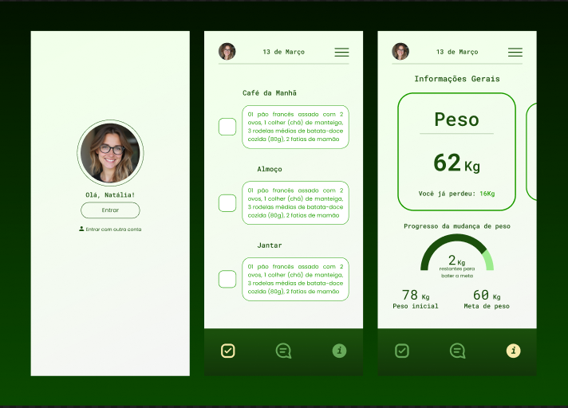
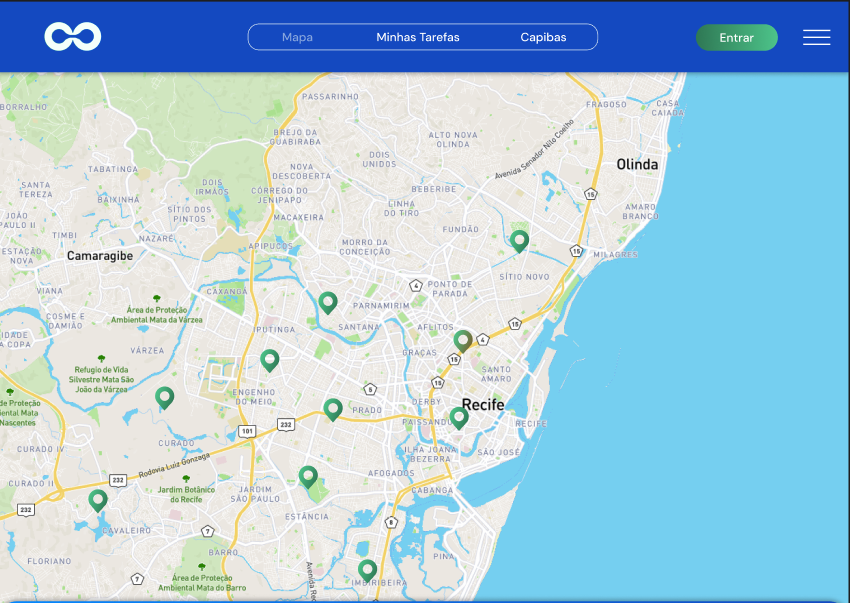
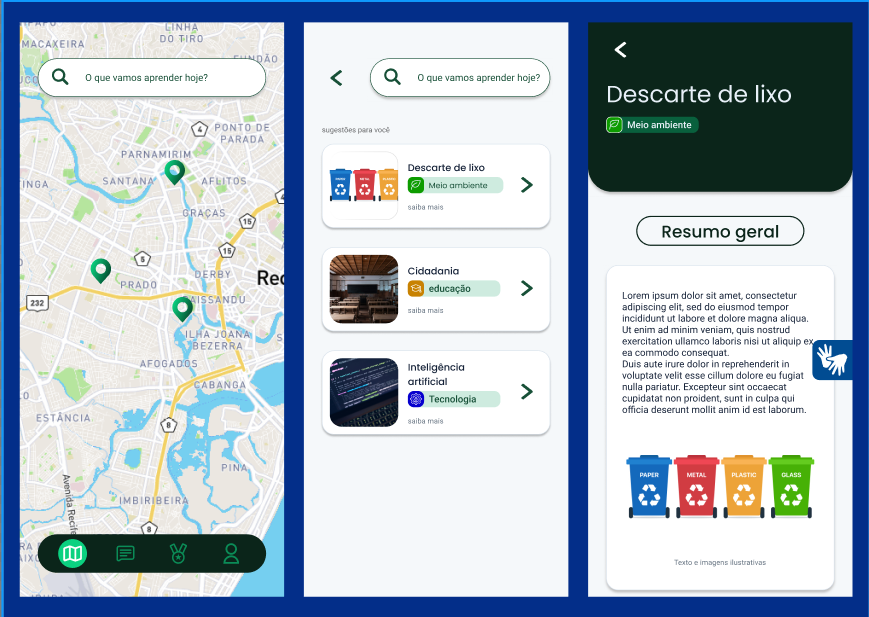

**`Desenvolvedor Front-end`** • **`Desenvolvedor web`** • **`Ui/Ux Designer`**

Olá, me chamo Vinícius, tenho 19 anos e atualmente estou cursando Sistemas de Informação no Centro de Informática da Universidade Federal de Pernambuco (CIn - UFPE) e sou apaixonado por Design UI/UX e Desenvolvimento de interfaces.

---

### Linguagens e Tecnologias:

  
  
  
  
  

---

### Veja também meus Projetos no Figma:

<b>Clique Aqui</b>

  

  | Preview | Projeto | Tecnologias | Link |
  | :---: | :--- | :--- | :---: |
  |   | **Agência de viagem - Horizonte** Primeiro protótipo de um website feito num curso da Udemy. | `Figma` `Ilustração` `UI/UX`| [Ver Figma ↗](https://www.figma.com/design/HgWKXxZq5wD8dmG7TsrNWX/primeiro-projeto?node-id=28-163&t=vBznIyE3CHqTpoFd-0)|
  |   | **App de Acompanhamento Nutricional - Cinutri** Projeto feito na cadeira de Concepção de de Artefatos digitais em 2025.1 | `Figma` `UI/UX` `Prototipação de baixo nivel`| [Ver Figma ↗](https://www.figma.com/design/bVYLrxTKmcGPfmvciC5sMi/Projeto-cad?node-id=0-1&t=ifwyy3WNYlWzNEo0-1) |
  |   | **Recife Point Game** prototipo de projeto feito para a prefeitura do recife. | `Figma` `Design UI` | [Ver Figma ↗](https://www.figma.com/design/5SUOeHMLqGSUGUmvso99Z0/RPG?t=vBznIyE3CHqTpoFd-0) |
  |   | **Plataforma Educaconal** Plataforma educacional de ensino. | `Figma` `design UI/UX` `Prototipação de baixo nivel` | [Ver Figma ↗](https://www.figma.com/design/lcMsB4kGOGGjuNU2r7urO0/V-lab?node-id=0-1&p=f&t=vBznIyE3CHqTpoFd-0) |
  

 

